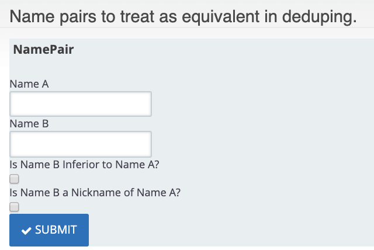

Afforms can be created by the GUI but it is also simple to create them in code.

Here is a sample form that simply renders the fields in an entity 
for editing. In this instance the entity is the custom entity 
ContactNamePair and it has the fields name_a, name_b, is_name_b_inferior, is_name_b_nickname.

The form requires 2 files. namePair.aff.json with the title & routing information
```
{
  "server_route": "civicrm/name-pair",
  "title": "Name pairs to treat as equivalent in deduping."
}
```
And namePair.html.json with the following directives af-form, af-entity, aff-field (one or more )
```
<af-form ctrl="modelListCtrl">
  <af-entity data="{}" url-autofill="1" type="ContactNamePair" name="NamePair" label="NamePair" />
  <fieldset af-fieldset="NamePair">
    <legend class="af-text">NamePair</legend>
    <af-field name="name_a" defn="{}" />
    <af-field name="name_b" defn="{}" />
    <af-field name="is_name_b_inferior" defn="{}" />
    <af-field name="is_name_b_nickname" defn="{}" />
  </fieldset><button class="af-button btn btn-primary" crm-icon="fa-check" ng-click="modelListCtrl.submit()">Submit</button>
</af-form>
```

This results in 


